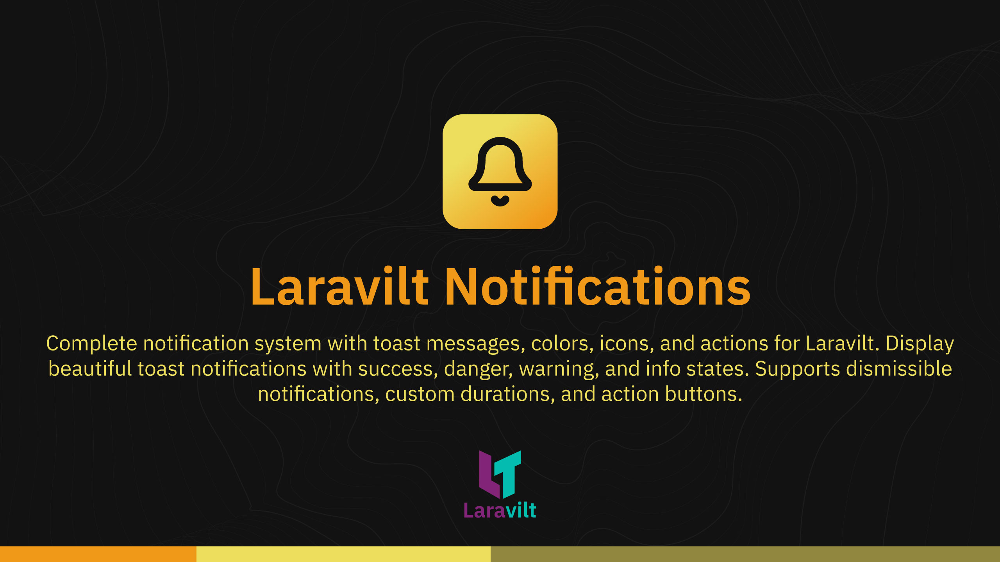

# Laravilt Notifications

[](https://packagist.org/packages/laravilt/notifications)
[](https://packagist.org/packages/laravilt/notifications)
[](https://packagist.org/packages/laravilt/notifications)
[](https://github.com/laravilt/notifications/actions/workflows/dependabot/dependabot-updates)
[](https://github.com/laravilt/notifications/actions/workflows/fix-php-code-styling.yml)
[](https://github.com/laravilt/notifications/actions/workflows/tests.yml)

Complete notification system with toast messages, colors, icons, and actions for Laravilt. Display beautiful toast notifications with success, danger, warning, and info states. Supports dismissible notifications, custom durations, and action buttons.

## Features

- 🎨 **Multiple States** - Success, danger, warning, info, and custom states
- 🎯 **Customizable** - Title, body, icon, color, and duration
- ✨ **Actions** - Add custom action buttons to notifications
- ⏱️ **Auto-dismiss** - Configurable duration with manual dismiss option
- 🔔 **Icon Support** - Heroicons and Lucide icon integration
- 📱 **Responsive** - Beautiful toast notifications on all devices
- ⚡ **Helper Functions** - Global notification helpers for easy use

## Installation

```bash
composer require laravilt/notifications
```

The package will automatically register its service provider.

## Quick Start

```php
use Laravilt\Notifications\Notification;

// Success notification
Notification::success()
    ->title('Success!')
    ->body('User created successfully')
    ->send();

// Danger notification
Notification::danger()
    ->title('Error!')
    ->body('Something went wrong')
    ->send();

// Warning notification
Notification::warning()
    ->title('Warning!')
    ->body('Please check your input')
    ->send();

// Info notification
Notification::info()
    ->title('Info')
    ->body('New update available')
    ->send();

// Custom notification
Notification::make()
    ->title('Custom Notification')
    ->body('This is a custom notification')
    ->icon('bell')
    ->color('purple')
    ->duration(5000)
    ->dismissible()
    ->send();
```

## Helper Functions

```php
// Global helper functions
notify()->success('User created successfully');
notify()->danger('Something went wrong');
notify()->warning('Please check your input');
notify()->info('New update available');

// With title and body
notify()->success(
    title: 'Success!',
    body: 'User created successfully'
);

// Custom notification
notify()
    ->title('Custom')
    ->body('Message')
    ->icon('bell')
    ->color('primary')
    ->send();
```

## Available Methods

- `title(string $title)` - Set notification title
- `body(string $body)` - Set notification body/message
- `icon(string $icon)` - Set notification icon
- `color(string $color)` - Set notification color
- `duration(int $milliseconds)` - Set auto-dismiss duration
- `dismissible(bool $dismissible = true)` - Make notification dismissible
- `status(string $status)` - Set notification status
- `actions(array $actions)` - Add action buttons
- `send()` - Send the notification

## Available States

- `success()` - Success state (green)
- `danger()` - Danger/error state (red)
- `warning()` - Warning state (orange)
- `info()` - Info state (blue)

## Available Colors

- `success` - Green
- `danger` - Red
- `warning` - Orange
- `info` - Blue
- `primary` - Primary brand color
- `secondary` - Secondary color

## Configuration

Publish the config file:

```bash
php artisan vendor:publish --tag="laravilt-notifications-config"
```

## Assets

Publish the plugin assets:

```bash
php artisan vendor:publish --tag="laravilt-notifications-assets"
```

## Views

Publish the views:

```bash
php artisan vendor:publish --tag="notifications-views"
```

## Migrations

Publish the migrations:

```bash
php artisan vendor:publish --tag="notifications-migrations"
```

## Frontend Integration (Vue 3)

The notifications are automatically available in your Inertia.js pages via the shared data.

```vue
<template>
  <NotificationContainer />
</template>

<script setup>
import NotificationContainer from '@/components/NotificationContainer.vue'
</script>
```

## Testing

```bash
composer test
```

## Code Style

```bash
composer format
```

## Static Analysis

```bash
composer analyse
```

## License

The MIT License (MIT). Please see [License File](LICENSE.md) for more information.
